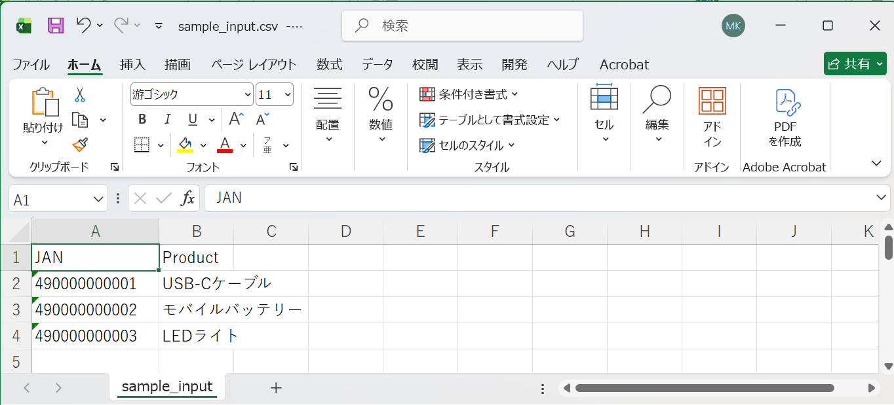
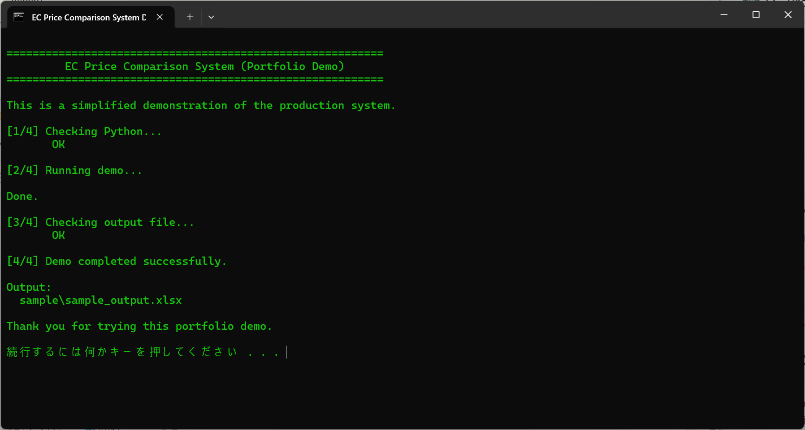
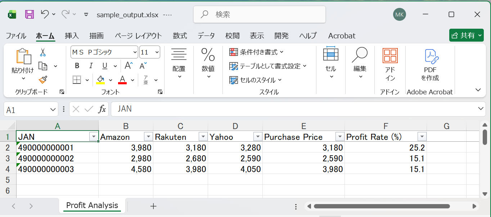

# EC Profit Analyzer

Pythonで作成した、EC運営向けの価格比較・利益分析デモツールです。

商品情報をCSVで入力すると、複数ショップの価格比較を行い、
推定仕入価格と利益率をExcelレポートとして出力します。

---

## Overview

EC運営では、以下のような作業が日常的に発生します。

* 商品情報の整理
* 複数サイトの価格確認
* 仕入判断
* 利益計算
* Excelへの転記

本ツールは、このような繰り返し作業をPythonで自動化する
業務改善デモとして開発しました。

---
## Screenshots

### Input CSV



### Demo Execution



### Profit Analysis


## Features

### CSV商品リスト入力

商品情報をCSV形式で読み込みます。

Example:

```csv
JAN,Product
490000000001,USB-Cケーブル
490000000002,モバイルバッテリー
490000000003,LEDライト
```

---

### Price Comparison

複数ショップの価格を比較します。

Demo data:

* Amazon
* Rakuten
* Yahoo

---

### Profit Analysis

最安仕入価格を算出し、利益率を計算します。

Calculation:

```text
Profit Rate =
(Selling Price - Purchase Price)
/
Purchase Price
× 100
```

---

### Excel Report Generation

分析結果をExcelファイルとして出力します。

Output:

```text
sample/sample_output.xlsx
```

Included:

* Price comparison
* Cheapest purchase price
* Profit rate

---

## Demo Execution

Windows環境では、

```text
Run Demo.bat
```

を実行してください。

処理内容:

```text
CSV Input

↓

Python Processing

↓

Price Comparison

↓

Profit Calculation

↓

Excel Report
```

---

## Demo Output

Generated Excel report:

```text
sample/sample_output.xlsx
```

Features:

* Header freeze
* Auto filter
* Number formatting
* Business-friendly layout

---

## Technology

* Python 3
* pandas
* openpyxl

---

## Note

This repository contains a simplified demonstration version.

The production version can be extended with:

* API integration
* Database connection
* Business-specific rules
* Additional automation workflows

---

## Background

This project was created based on practical experience with
EC operations and repetitive business workflows.

The objective is not only software development,
but also understanding existing operations and improving them
without changing the user's current workflow.


---

<p align="center">
  A2E Works
Practical automation tools for real-world workflows.
</p>
